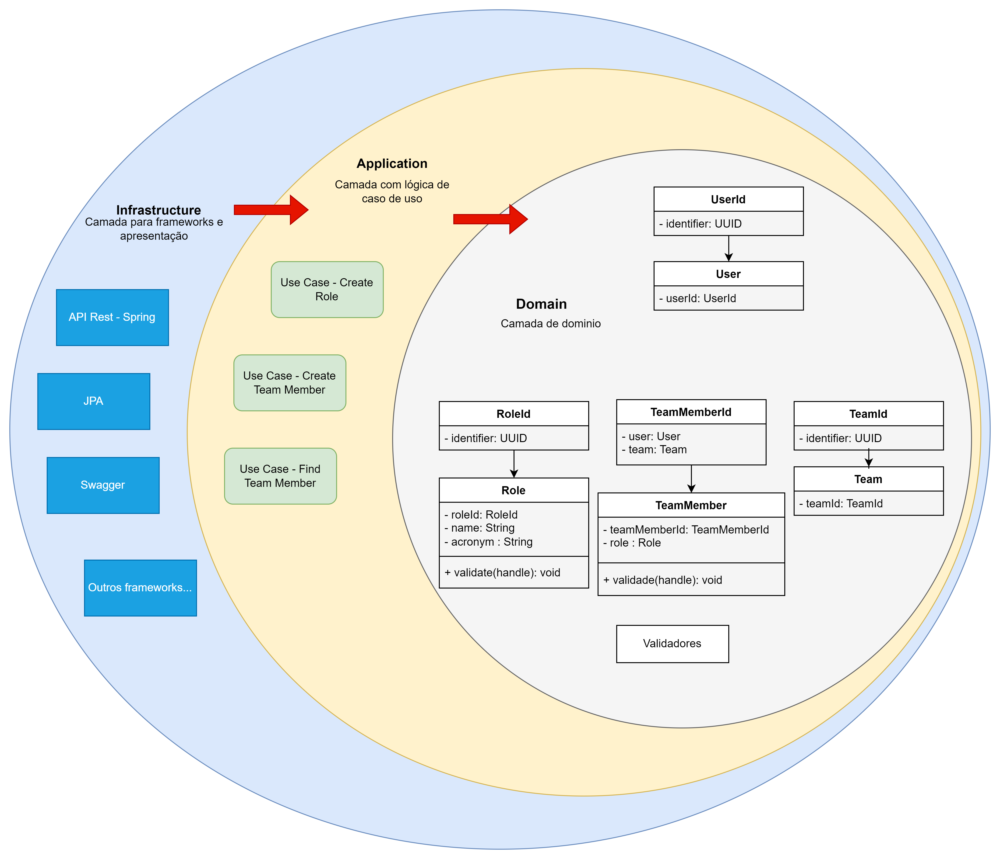

## Sobre o desafio

Foi dedicado apenas 1 dias e meio para composição da arquitetura e implementação funcional de um requisito.

- Decisões Arquiteturais:
1. O Design Clean Arquitecture foi levado em consideração na implementação, onde a aplicação foi dividida em 3 módulos
principais (Dominio, Aplicação e Infraestrutura). Com essa divisão as camadas externas de frameworks não tem acesso as
mais internas, não existindo o acoplamento.
2. Foi utilizado DDD para a quebra do domínio.
3. Todo o desenvolvimento foi realizando com TDD. *Pelo curto tempo não deu para aplicar o Jackson com h2 para testes 
de integração.




## Ferramentas necessárias

- IDE de sua preferência
- JDK 17
- Docker

## Como executar?

1. Clonar o repositório ou importar o projeto:
```sh
git clone 
```

2. Subir o banco de dados MySQL com Docker:
```shell
docker-compose up -d
```

3. Executar a aplicação como SpringBoot app:
```shell
  ./gradlew bootRun
``` 

4. Documentação: 
```http://localhost:8080/api/swagger-ui/index.htm```


5. Exemplo de requisição:

- Create Role:

```
    POST: ```http://localhost:8080/api/roles```
    
    Request JSON:
    
    {
    "name": "developer",
    "acronym": "DEV"
    }
    
    Response:
    
    {
    "id": "f316ef99-f888-4363-89ab-1f6f0c3503ca"
    }
```

## Banco de dados

O banco de dados principal é um MySQL e para subir localmente vamos utilizar o
Docker. Execute o comando a seguir para subir o MySQL:

```shell
docker-compose up -d
```

Para não precisar enviar arquivo DDL nesse desafio, foi configurado o DDL do Hibernate como:
ddl-auto: create-drop

O MySQL será consumido na porta 3306.